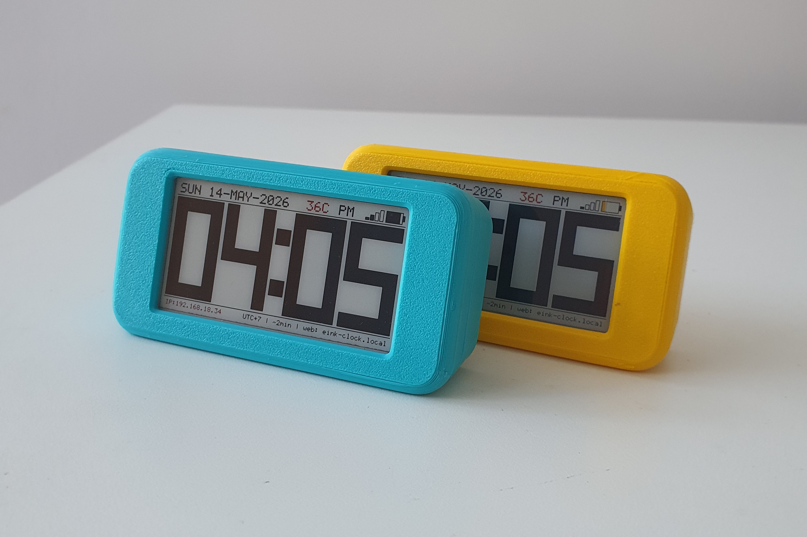

# E-ink Mini Clock

This repository contains the source code, hardware design files, and documentation for the E-ink Mini Clock project.

 

A fun 1 month project, which i spent on building this mini e-ink clock with 2.66" 4-color e-paper. A complete project involving hardware design, firmware development, 3D case modeling, and assembly. Which I documented the entire build process in a detailed YouTube video, sharing insights and challenges along the way. it's a great project for learning and improving my skills in each aspect of embedded system development, and also a fun and useful gadget for my desk.
